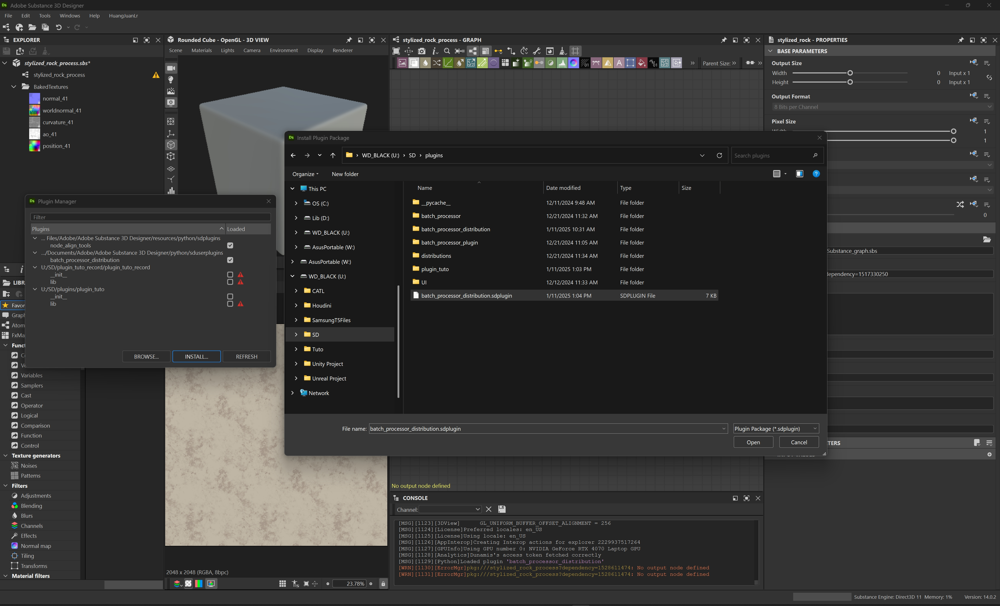
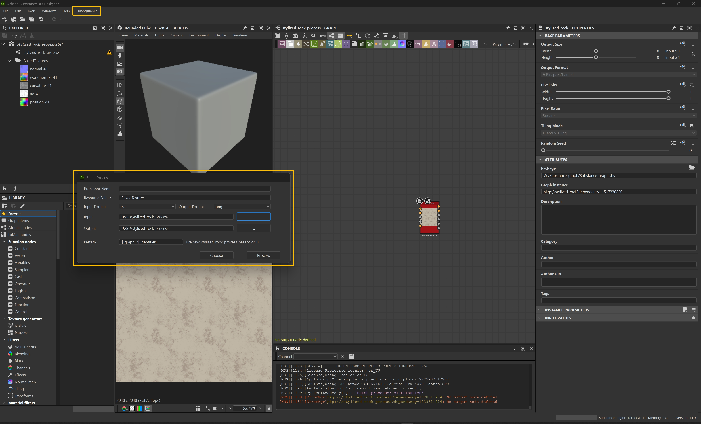
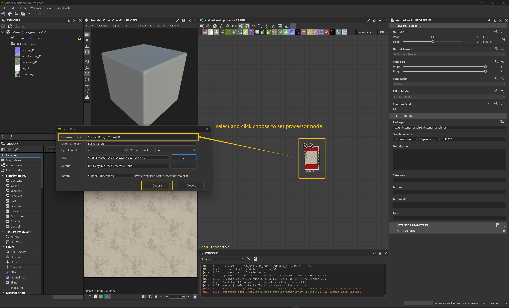
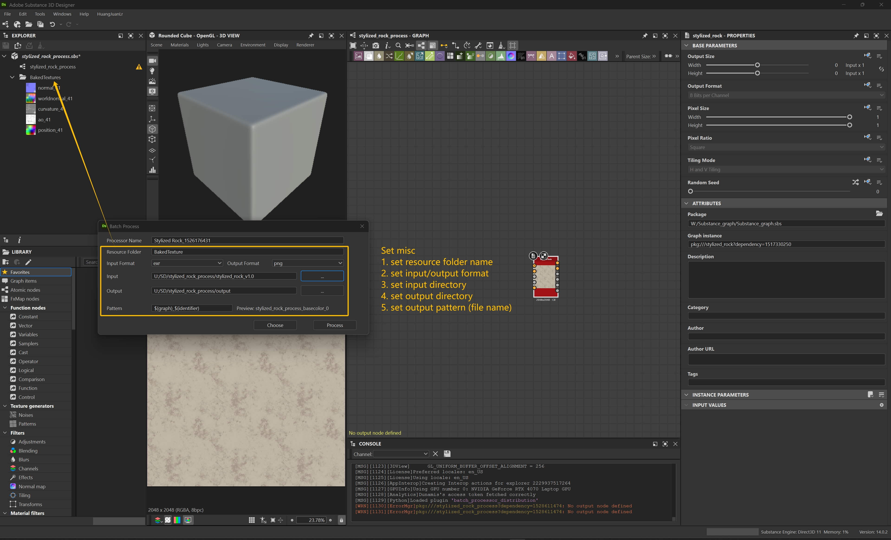
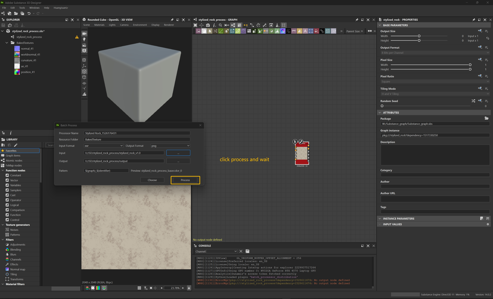

# Batch Process Tool

## Example:

Please follow the instruction below to use the plugin

### Install Plugin
1.Download the latest package from release

### Open Window

### Choose Processor

### Set Miscellaneous

### Process
